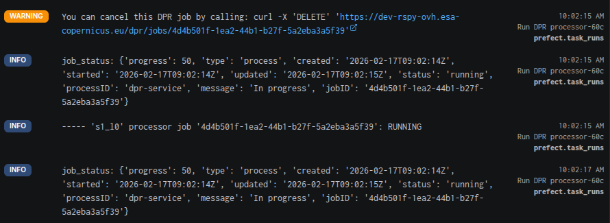
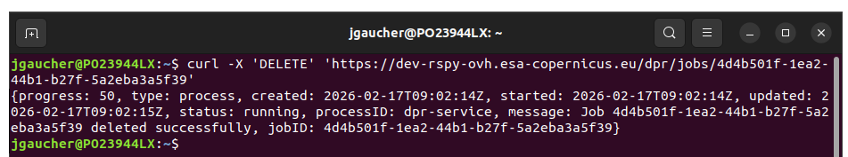
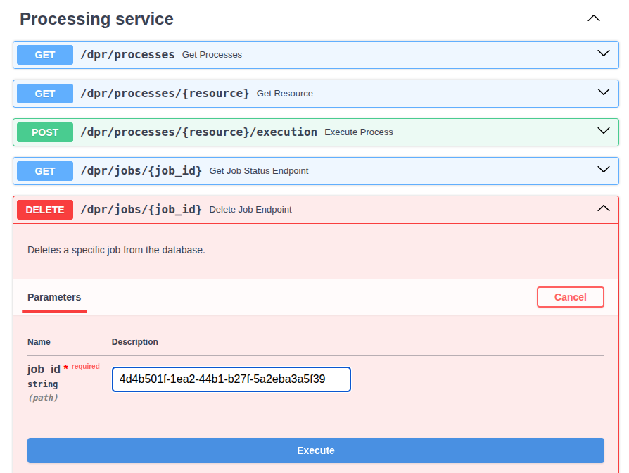

# Cancel a DPR run

After triggering a run of the processor, you can go to the Prefect flow run UI and you will see this warning:



If you copy/paste it in any local terminal:



The flow will be cancelled. The Prefect logs will show:

```
# ...
Force termination of EOPF job: '4d4b501f-1ea2-44b1-b27f-5a2eba3a5f39'
# ...
RuntimeError: 's1_l0' processor job '4d4b501f-1ea2-44b1-b27f-5a2eba3a5f39': NOT FOUND
# ...
Finished in state Failed("Task run encountered an exception RuntimeError: Exception while monitoring job 's1_l0' processor:
{
  'type': 'https://developer.mozilla.org/en/docs/Web/HTTP/Reference/Status/404',
  'status': 404,
  'detail': 'Job with ID 4d4b501f-1ea2-44b1-b27f-5a2eba3a5f39 not found'
}
# ...
Process for flow run 'upbeat-avocet' exited with status code: 1
```

To cancel the DPR run, instead of copy/pasting the curl command, you can also go to the Swagger page and enter the job id in the `/dpr/jobs/{job_id} Delete Job Endpoint`:



But be careful to enter the DPR job ID, because there are other job ids in the prefect logs, e.g. for the staging:
```
job_status: {
  'status': 'running',
  'type': 'process',
  'created': '2026-02-17T09:02:06Z',
  'message': 'Sending tasks to the dask cluster',
  'progress': 0,
  'processID': 'staging',
  'started': '2026-02-17T09:02:06Z',
  'updated': '2026-02-17T09:02:06Z',
  'jobID': '556363bf-c74d-41cf-931d-1972fe8a7b87'
}

----- Staging from 'mockup-station-adgs.processing.svc.cluster.local' job '556363bf-c74d-41cf-931d-1972fe8a7b87': RUNNING
```

If you enter a staging job ID, you'll have a message saying the job was deleted successfully, but it will have no effect on the DPR run.
